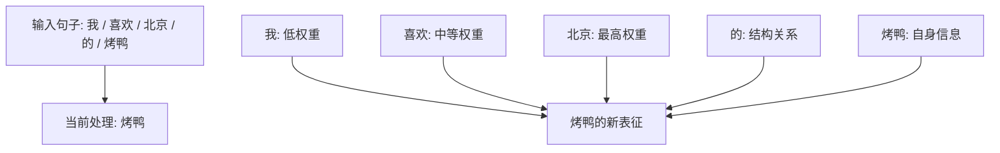

## Diagram Plan

**Material**: Transformer self-attention intuition for the sentence "我喜欢北京的烤鸭"
**Diagrams**: 1
**Type**: illustrative
**Named elements**: 我, 喜欢, 北京, 的, 烤鸭, attention weights, contextual representation
**Reader need**: After seeing this diagram, the reader understands that when processing "烤鸭", attention directly looks at every token in the sentence and assigns different weights.
**Slug**: attention-beijing-duck
**Language**: zh

## Layout

- Canvas: `680 x 500`
- Title y=42, subtitle y=64.
- Token row at y=130, five rounded boxes.
- Focus token "烤鸭" highlighted with accent fill.
- Curved connectors from each token to a central representation box. Stroke widths encode approximate attention weight:
  - 北京: thickest
  - 喜欢: medium
  - 的: medium-light
  - 我: thin
  - 烤鸭: self connection, medium
- Output representation box at bottom, with short formula text.
- Footer explains: attention is a direct weighted lookup over the whole sentence, not a left-to-right relay.
