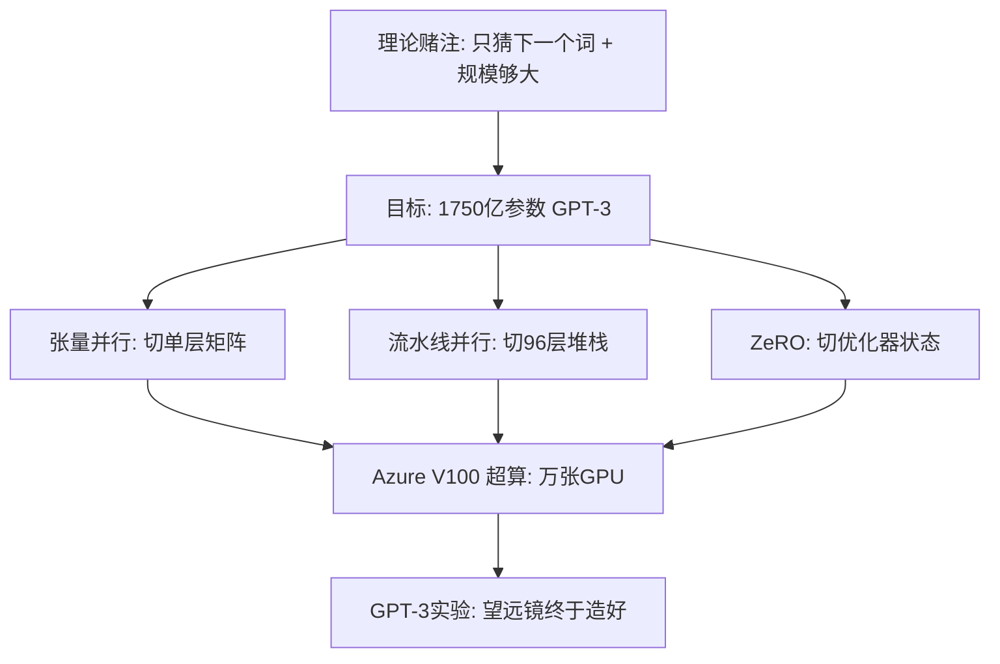

## Diagram Plan

**Material**: Section 1.3 "GPT-3 的赌注：先要有望远镜"
**Diagrams**: 1
**Type**: illustrative / structural hybrid
**Named elements**: Scaling law, 1750亿参数, tensor parallelism, pipeline parallelism, ZeRO, Azure V100 supercomputer, GPT-3 experiment
**Reader need**: After seeing this diagram, the reader understands that GPT-3 was not just a model-size bet; it required three engineering splits plus a large GPU cluster before the theoretical bet could be tested.
**Slug**: gpt3-engineering-telescope
**Language**: zh

## Layout

- Canvas: `680 x 620`
- Use Baoyu local design system.
- Top layer-key: theoretical bet and 175B target.
- Middle three sibling containers:
  - 张量并行: 横着切单层矩阵
  - 流水线并行: 竖着切96层
  - ZeRO: 切优化器状态、梯度、参数
- Lower convergence layer: Azure V100 supercomputer.
- Footer: "工程先造出望远镜，理论才看见新大陆。"
