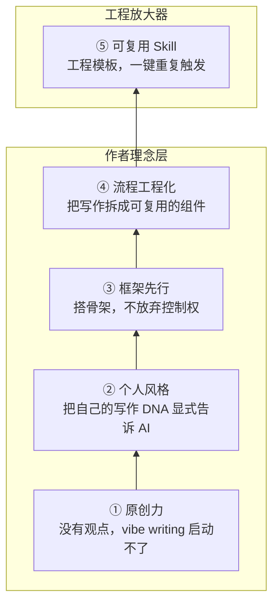

# Vibe Writing 五要素分层架构图 · 生成计划

## Type routing
结构化架构图 (structural)。用户明确要求"分层架构图 / 堆叠金字塔"，五个要素之间是层级依赖关系（bottom supports top），不是时间顺序（flowchart）也不是消息交互（sequence）。

## Named elements (5)
1. 原创力（根基）
2. 个人风格
3. 框架先行
4. 流程工程化
5. 可复用 Skill（工程放大器）

## Reader need
After seeing this diagram, the reader understands Vibe Writing 的五要素是层级依赖关系，前 4 层是作者理念（底座），第 5 层是工程放大器（把前四者打包成可复用模板），不是平行的五点。

## Mermaid sketch (structural intent)

## Visual design

- viewBox: 680 × 510
- 5 rects 同宽 (500px)，从底到顶堆叠
- Layer 1 (根基): 稍高 (75px) 显示根基感
- Layers 2-4: 标准 60px
- Layer 5 (顶): 稍高 (80px) + accent color + 强描边
- 前 4 层用暖色系 (warm beige `#F5F0E8`) 表达"人的理念"
- 第 5 层用 teal accent (`#CCFBF1` / `#14B8A6`) 表达"工程杠杆"
- 左侧加 bracket 标注"作者理念层" / "工程层"
- 每层内：圆形编号 badge + 标题 + 副标题
- 支持 light/dark mode

## Layout math (y 坐标)

- 主标题: y=40
- 副标题: y=62
- Layer 5 (顶): y=90-170 (h=80, accent)
- Layer 4: y=178-238 (h=60)
- Layer 3: y=246-306 (h=60)
- Layer 2: y=314-374 (h=60)
- Layer 1 (底): y=382-462 (h=80)
- 脚注说明: y=495
- viewBox 高度: 510

## Output
- `diagram.svg`
